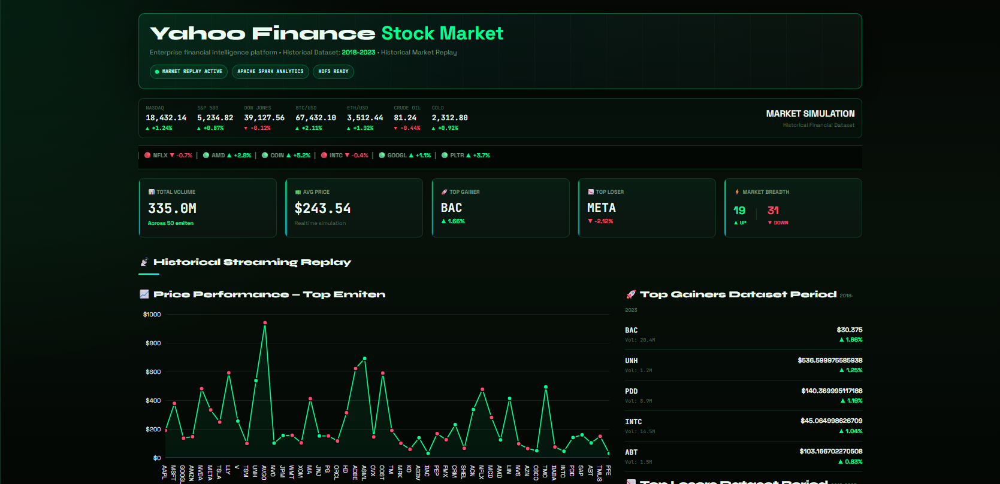
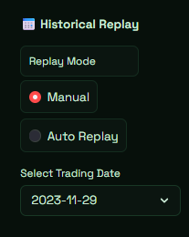
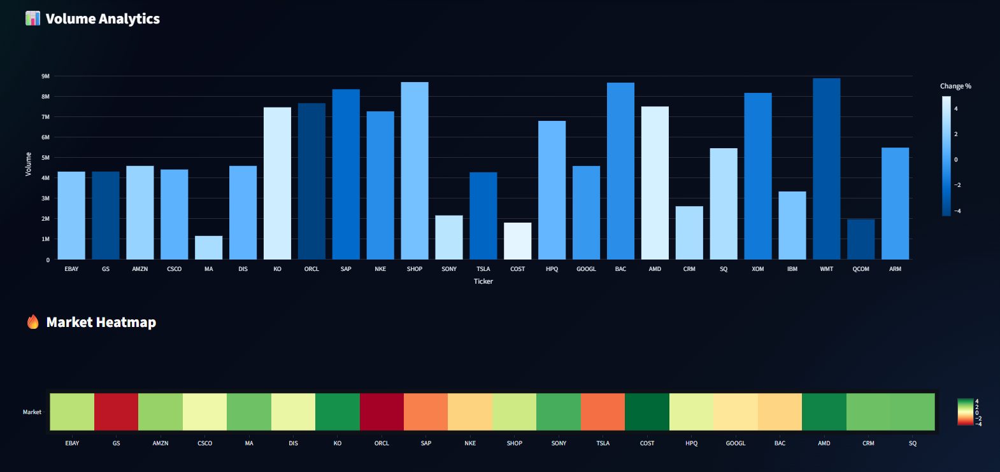
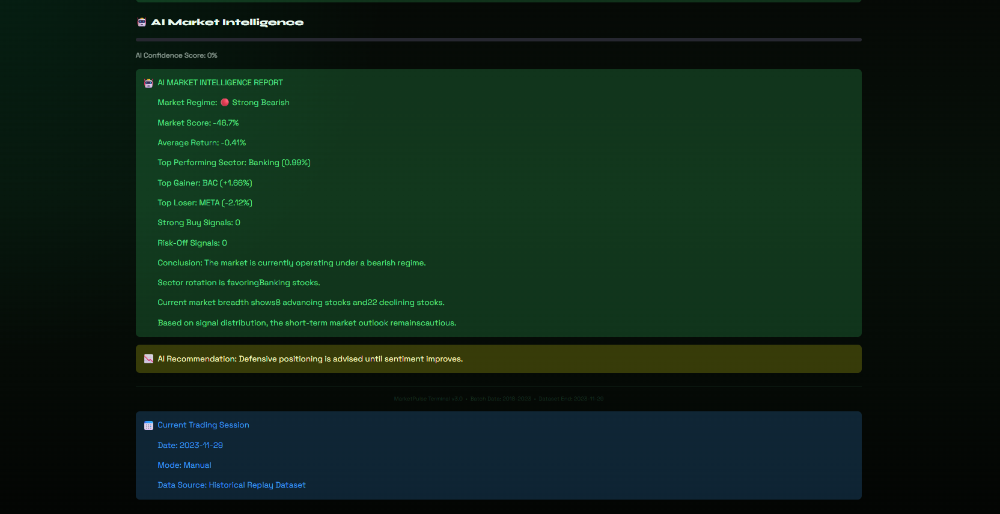
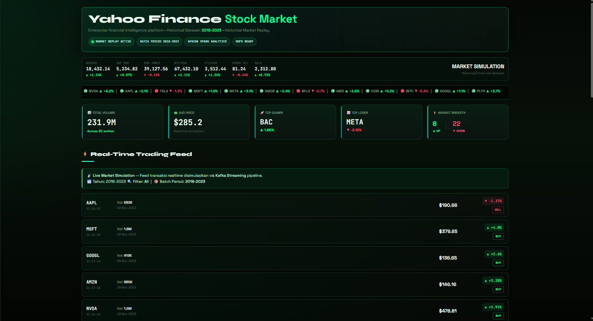
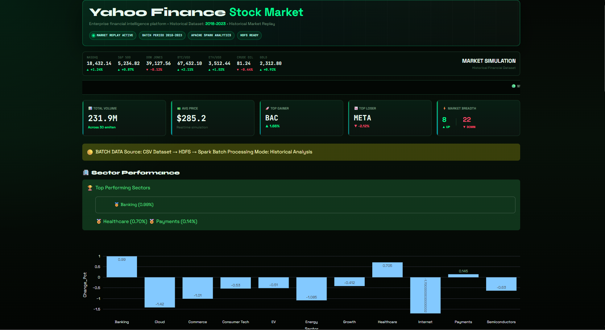
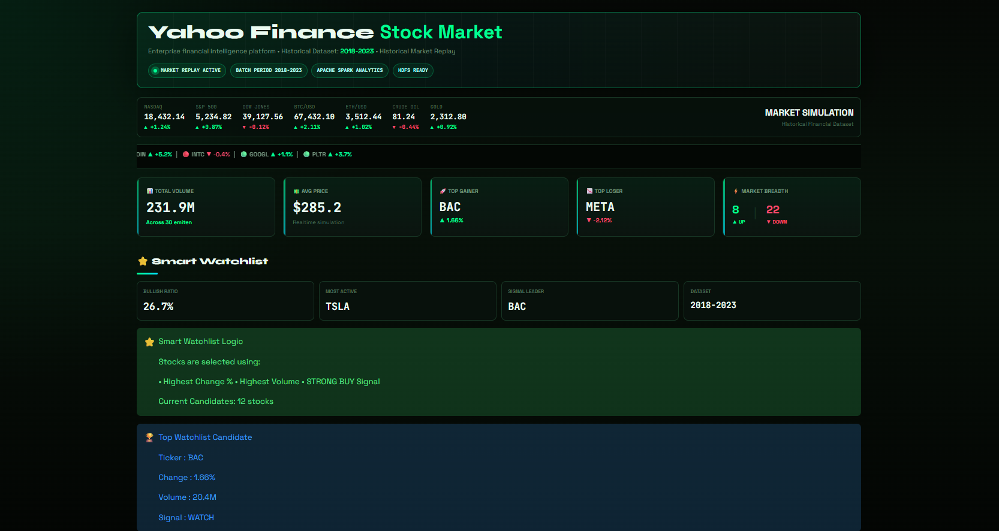
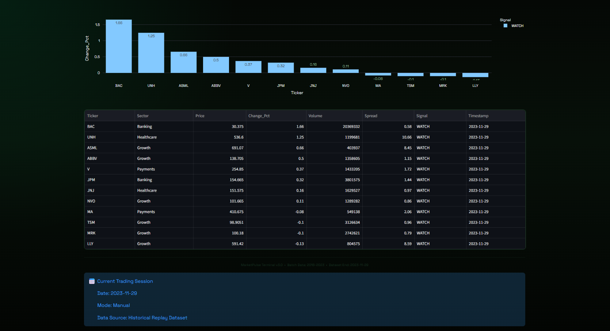
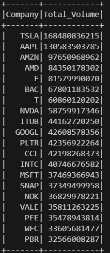
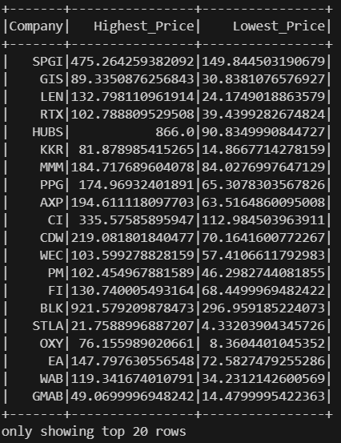

# 📈 Yahoo Finance Market Stock
## End-of-Semester Project — Big Data Processing
---

# Table of Contents

1. Executive Summary
2. Introduction
3. Project Background
4. System Objectives
5. Architecture Diagram
6. System Architecture Explanation
7. Problem Statement
8. Business Questions
9. Dataset Explanation
10. Technology Stack
11. Project Structure
12. End-to-End Pipeline Workflow
13. Detailed Component Explanation
14. Distributed Processing Concepts
15. Real-Time Streaming Concepts
16. Batch Processing Concepts
17. Dashboard Visualization System
18. How To Run
19. Expected Output
20. Dashboard Features
21. Batch Analysis Findings
22. Streaming Analysis Findings
23. Technical Challenges Faced
24. Learning Outcomes
25. System Limitations
26. Future Improvements
27. Conclusion

---

# Executive Summary

Yahoo Market Stock is a distributed real-time financial analytics platform designed to simulate how modern big data systems process, analyze, and visualize stock market activity.

This project combines:

* Apache Kafka,
* Apache Spark Structured Streaming,
* Docker Compose,
* Python,
* and Streamlit

to build a complete end-to-end big data processing pipeline capable of supporting both:

* historical batch analysis,
* and real-time streaming analytics.

The system continuously streams stock market records into Kafka using a custom Python producer. Apache Spark Structured Streaming consumes the incoming stock market events and performs distributed financial analytics such as:

* volume aggregation,
* stock activity analysis,
* market fluctuation monitoring,
* and streaming event processing.

Simultaneously, Spark batch processing analyzes historical market activity to identify:

* dominant companies,
* historical price ranges,
* highest trading volumes,
* and long-term financial patterns.

The analytics results are visualized through an interactive Streamlit dashboard designed using a modern fintech-inspired interface.

This project demonstrates how distributed technologies can work together to build scalable, reproducible, and efficient financial analytics systems.

---

# Introduction

Modern industries generate massive amounts of data every second. Financial markets are among the largest producers of continuously changing real-time information.

Every stock transaction generates:

* market activity,
* trading volume,
* price movement,
* and financial indicators.

As financial markets grow increasingly data-driven, companies require systems capable of:

* handling high-throughput streaming data,
* processing analytics with low latency,
* and visualizing insights in real time.

Traditional systems often struggle with:

* scalability limitations,
* inefficient data processing,
* delayed analytics,
* and infrastructure bottlenecks.

To solve these problems, modern financial systems rely heavily on distributed technologies such as:

* Apache Kafka,
* Apache Spark,
* distributed streaming platforms,
* and scalable visualization systems.

This project was developed to simulate a modern distributed financial analytics architecture capable of:

* streaming stock market events,
* processing financial analytics,
* and visualizing real-time market intelligence.

The project demonstrates practical implementations of:

* real-time data engineering,
* distributed analytics,
* stream processing,
* and containerized big data infrastructures.

---

# Project Background

The financial sector increasingly depends on real-time analytics systems for:

* stock monitoring,
* market intelligence,
* fraud detection,
* algorithmic trading,
* and investment decision-making.

Modern financial systems must continuously process:

* millions of events,
* large-scale transactions,
* and rapidly changing market activity.

As data volume grows, traditional monolithic systems become insufficient due to:

* limited scalability,
* slow processing performance,
* and centralized bottlenecks.

Distributed technologies provide solutions by enabling:

* scalable event streaming,
* distributed processing,
* parallel computation,
* and real-time analytics generation.

This project was inspired by how financial companies use:

* Kafka for streaming infrastructure,
* Spark for distributed analytics,
* and interactive dashboards for real-time visualization.

The project demonstrates how these technologies can be integrated into a simplified but realistic financial analytics platform.

---

# System Objectives

The primary objective of this project is to develop a distributed big data pipeline capable of handling:

* historical financial analysis,
* real-time stock market event processing,
* and interactive visualization.

The project aims to:

* simulate stock market streaming activity,
* process financial analytics using distributed systems,
* generate both batch and streaming insights,
* and visualize analytics interactively.

Additional objectives include:

* demonstrating Kafka event streaming,
* implementing Spark Structured Streaming,
* applying distributed batch analytics,
* and building a containerized analytics infrastructure.

---

# Architecture Diagram

The following architecture illustrates the complete end-to-end data pipeline used in this project.


---

# 🎥 Video Demonstration

A complete demonstration of the Yahoo Finance Market Stock platform is available through the video below.

The demonstration showcases:

- Dashboard Overview
- Historical Market Replay
- Apache Kafka Streaming Simulation
- Apache Spark Analytics
- AI Market Intelligence
- Smart Watchlist
- Market Sentiment Heatmap
- Live Trading Feed

[](https://youtu.be/enK7a7gSMfk)

Click the image above to watch the full project demonstration video.

---

# 📸 System Preview

The following screenshots demonstrate the real-time functionality, distributed analytics processing, and visualization capabilities of the Yahoo Finance Market Stock platform.

These screenshots provide visual evidence that the distributed big data pipeline is fully operational and capable of handling both streaming and batch analytics workloads.

---

# Dashboard Overview

The Yahoo Finance Stock Market Dashboard serves as the central interface for monitoring historical and streaming financial analytics. The dashboard integrates KPI monitoring, market breadth analysis, top gainers and losers, and historical replay capabilities into a single fintech-inspired visualization platform.

Features:
- Market KPI Cards
- Top Gainers & Top Losers
- Market Breadth Analysis
- Historical Replay Controls
- Financial Market Monitoring


---

# Historical Market Replay

One of the core features of the project is Historical Market Replay. Instead of replaying data through repeated refreshes, users can directly select any available trading date from the historical dataset.

The replay engine allows users to:

- Select historical trading sessions
- Navigate market conditions from different periods
- Analyze stock behavior across time
- Simulate historical market activity

This feature transforms static historical records into an interactive market simulation experience.



---

# Market Sentiment Heatmap

The heatmap provides a visual representation of market sentiment based on stock price changes.

Color Interpretation:

🟢 Green = Bullish Movement

🔴 Red = Bearish Movement

The heatmap allows users to quickly identify sectors and companies driving market performance.



---

# AI Market Intelligence

The platform includes a rule-based market intelligence engine capable of generating automated market insights.

Generated information includes:

- Market Regime Detection
- Bullish/Bearish Assessment
- Top Sector Identification
- Top Gainer & Top Loser Detection
- Market Recommendations

The AI module transforms analytical results into understandable market intelligence reports.



---

# Real-Time Trading Feed

The platform simulates market activity by replaying historical stock market records from the dataset period (2018–2023), creating a realistic streaming analytics experience.

The live feed displays:
- bullish market activity,
- bearish market movement,
- trading volume updates,
- and real-time financial alerts.

This demonstrates continuous streaming visualization capabilities within the dashboard.



---

# Financial Analytics Dashboard

The Analytics page provides deeper insights into historical market performance using Spark Batch Processing.

Analytics include:

- Sector Performance Analysis
- Historical Market Trends
- Aggregated Financial Metrics
- Cross-sector Comparisons



---

# Smart Watchlist

The Smart Watchlist automatically identifies stocks that deserve investor attention based on:

- Trading Volume
- Price Momentum
- Sector Strength
- Signal Classification

The watchlist helps users quickly identify promising market opportunities.



---

# Watchlist Candidate Details

Each watchlist candidate is accompanied by detailed financial information including:

- Sector Classification
- Volume Analysis
- Price Performance
- Signal Type
- Historical Snapshot



# Kafka Event Streaming

Apache Kafka acts as the messaging backbone of the system.

Responsibilities:

- Event ingestion
- Stream buffering
- Distributed message delivery
- Producer-consumer communication

The Kafka producer continuously transforms historical stock records into streaming events that are consumed by Spark Structured Streaming.



---

# Historical Batch Analytics

Apache Spark Batch Processing is used to analyze over 600,000 historical stock records.

The batch layer performs:

- Average Price Analysis
- Volume Aggregation
- Historical Trend Detection
- Long-Term Market Insights

This complements the streaming layer by providing historical market intelligence.



---

# System Architecture Explanation

The architecture consists of several interconnected distributed components responsible for:

* event ingestion,
* stream processing,
* distributed analytics,
* and visualization.

Each layer has a specific responsibility within the pipeline.

---

# 1️. Historical Dataset Layer

The pipeline begins with a historical stock market dataset stored in CSV format (`stock_data.csv`).

The dataset contains:

* opening prices,
* closing prices,
* highest prices,
* lowest prices,
* trading volume,
* and company information.

This dataset acts as the primary data source for:

* historical batch analytics,
* and simulated real-time stock event streaming.

The dataset provides realistic financial market activity used throughout the system.

---

# 2️. Kafka Producer Layer

The Kafka producer is implemented using Python.

The producer continuously:

* reads stock market records,
* transforms rows into streaming events,
* serializes stock information,
* and streams messages into Apache Kafka.

Instead of sending all records simultaneously, the producer streams data gradually to simulate:

* live stock activity,
* real-time event flow,
* and continuous market movement.

This creates a realistic streaming environment similar to actual financial infrastructures.

---

# 3️. Apache Kafka Streaming Layer

Apache Kafka acts as the distributed event streaming platform.

Kafka is responsible for:

* receiving stock market events,
* storing streaming messages,
* and distributing events to downstream consumers.

Kafka enables:

* asynchronous communication,
* high-throughput event ingestion,
* scalability,
* fault tolerance,
* and distributed event handling.

Within this project, Kafka serves as the communication bridge between:

* the producer,
* and Spark Structured Streaming.

Kafka allows stock events to be processed continuously without tight coupling between services.

---

# 4️. Spark Structured Streaming Layer

Apache Spark Structured Streaming functions as the distributed stream processing engine.

Spark continuously consumes stock market events from Kafka and performs:

* real-time aggregation,
* distributed analytics,
* market activity monitoring,
* and streaming financial calculations.

Spark processes streaming data using:

* distributed computation,
* micro-batch execution,
* and parallel analytics processing.

The streaming layer enables:

* low-latency analytics,
* scalable processing,
* and continuous financial event monitoring.

This demonstrates how modern distributed processing systems analyze continuously incoming data streams efficiently.

---

# 5️. Batch Processing Layer

In addition to streaming analytics, Spark also performs historical batch analysis.

The batch processing job analyzes:

* average stock prices,
* highest trading volumes,
* historical market fluctuations,
* and company performance trends.

Batch processing demonstrates Spark’s ability to:

* process large historical datasets,
* perform distributed computation,
* and generate long-term analytical insights.

This layer complements the streaming pipeline by providing historical financial intelligence.

---

# 6️. Dashboard Visualization Layer

The Streamlit dashboard acts as the visualization and presentation layer.

The dashboard visualizes:

* financial KPIs,
* stock activity,
* streaming analytics,
* market movement,
* interactive charts,
* and financial insights.

The dashboard was designed using a modern fintech-inspired interface to simulate professional financial analytics platforms.

The visualization layer transforms complex streaming data into:

* understandable insights,
* interactive analytics,
* and user-friendly financial dashboards.

---

# Problem Statement

Financial institutions require systems capable of:

* processing continuously incoming market events,
* analyzing large-scale historical data,
* and visualizing analytics in real time.

Traditional systems often struggle with:

* delayed analytics,
* scalability limitations,
* infrastructure bottlenecks,
* and inefficient data processing pipelines.

This project addresses these challenges by implementing a distributed financial analytics system capable of:

* ingesting stock events in real time,
* processing distributed analytics,
* generating streaming insights,
* and visualizing market intelligence interactively.

The project demonstrates how distributed technologies can support scalable financial analytics infrastructures.

---

# Business Questions

The project was designed to answer several analytical business questions.

---

# Historical Batch Analytics Questions

Which companies:

* generate the highest trading volumes?
* demonstrate the highest average closing prices?
* show the widest historical price fluctuations?
* dominate long-term market activity?

---

# Real-Time Streaming Analytics Questions

Which stocks are currently:

* experiencing abnormal activity?
* generating unusual volume spikes?
* showing rapid price movement?
* dominating streaming analytics?

---

# Dataset Explanation

## Dataset Name

`stock_data.csv`
---

## Dataset Domain

Financial Market Analytics

---

## Dataset Description

The dataset contains historical stock market trading records from multiple publicly traded companies.

Each row represents:

* one company,
* on one trading day,
* with corresponding financial activity.

The dataset includes:

* opening prices,
* highest prices,
* lowest prices,
* closing prices,
* trading volumes,
* and company identifiers.

---

## Dataset Fields

| Column  | Description         |
| ------- | ------------------- |
| Date    | Trading date        |
| Open    | Opening stock price |
| High    | Highest stock price |
| Low     | Lowest stock price  |
| Close   | Closing stock price |
| Volume  | Trading volume      |
| Company | Company name        |

---

## Dataset Usage

The dataset is utilized for:

* Kafka event streaming,
* Spark streaming analytics,
* batch processing,
* dashboard visualization,
* and financial insight generation.

---

# Technology Stack

| Technology     | Purpose                      |
| -------------- | ---------------------------- |
| Python         | Core programming language    |
| Apache Kafka   | Real-time event streaming    |
| Apache Spark   | Distributed analytics engine |
| PySpark        | Batch & streaming processing |
| Docker Compose | Container orchestration      |
| Streamlit      | Interactive dashboard        |
| Pandas         | Data manipulation            |
| Plotly         | Interactive visualization    |

---

# Project Structure

```bash id="f6i6h4"
alpbigdata-finance-project/
│
├── docker-compose.yml
├── README.md
│
├── producer/
│   ├── producer.py
│   └── requirements.txt
│
├── jobs/
│   ├── batch_analysis.py
│   └── streaming_job.py
│
├── dashboard/
│   ├── Dockerfile
│   ├── requirements.txt
│   └── app.py
│
└── data/
    └── stock_data.csv
```

---

# End-to-End Pipeline Workflow

The project follows the workflow below:

1. Historical stock market data is loaded from CSV.
2. The Python producer streams stock events into Kafka.
3. Kafka stores and distributes streaming messages.
4. Spark Structured Streaming consumes stock events.
5. Spark performs distributed analytics processing.
6. Batch jobs analyze historical financial activity.
7. Streamlit visualizes streaming analytics interactively.

---

# Detailed Component Explanation

## Kafka Producer

Responsible for:

* event generation,
* real-time simulation,
* and message streaming.

---

## Kafka Broker

Responsible for:

* event ingestion,
* asynchronous communication,
* and distributed message handling.

---

## Spark Streaming

Responsible for:

* distributed analytics,
* stream aggregation,
* and real-time processing.

---

## Batch Processing

Responsible for:

* historical insight generation,
* large-scale analysis,
* and long-term financial analytics.

---

## Streamlit Dashboard

Responsible for:

* interactive visualization,
* financial KPI presentation,
* and real-time dashboard rendering.

---

# Distributed Processing Concepts

The project demonstrates distributed computing concepts such as:

* parallel analytics,
* distributed execution,
* scalable processing,
* and fault-tolerant architectures.

Apache Spark distributes computations across processing tasks to improve:

* performance,
* scalability,
* and analytics efficiency.

---

# Real-Time Streaming Concepts

The streaming pipeline demonstrates:

* continuous event processing,
* asynchronous communication,
* low-latency analytics,
* and live market monitoring.

Kafka and Spark work together to create a scalable streaming infrastructure capable of handling continuously incoming financial events.

---

# Batch Processing Concepts

Batch processing enables the system to:

* analyze historical financial trends,
* process large datasets efficiently,
* and generate long-term market intelligence.

Spark batch analytics calculate:

* average prices,
* market activity,
* trading volume,
* and historical price fluctuations.

---

# Dashboard Visualization System

The dashboard was designed using:

* Streamlit,
* Plotly,
* and interactive financial visualization techniques.

The dashboard includes:

* KPI cards,
* donut charts,
* volume analytics,
* interactive market charts,
* and real-time stock activity monitoring.

The design was inspired by modern:

* fintech dashboards,
* trading platforms,
* and financial intelligence systems.

---

# How To Run

## Step 1 — Clone Repository

```bash id="abpjxv"
git clone https://github.com/JepperWL/alpbigdata-finance-project.git
cd alpbigdata-finance-project
```

---

## Step 2 — Start Docker Containers

```bash id="1v7pn9"
docker compose up -d
```

---

## Step 3 — Verify Containers

```bash id="8q8f96"
docker ps
```

Expected running containers:

* zookeeper
* kafka
* spark
* streamlit

---

## Step 4 — Create Kafka Topic

```bash id="hm7mkf"
docker exec -it kafka bash
```

Inside Kafka container:

```bash id="8qog3k"
/opt/kafka/bin/kafka-topics.sh \
--create \
--topic stock-market \
--bootstrap-server localhost:9092
```

---

## Step 5 — Run Kafka Producer

Open new terminal:

```bash id="8z94bq"
cd producer
python producer.py
```

---

## Step 6 — Run Spark Streaming Job

```bash id="6g8xv4"
docker exec -it spark bash
```

Inside Spark container:

```bash id="3guhja"
spark-submit /home/jovyan/work/jobs/streaming_job.py
```

---

## Step 7 — Run Batch Analysis

Inside Spark container:

```bash id="j6v5z0"
spark-submit /home/jovyan/work/jobs/batch_analysis.py
```

---

## Step 8 — Open Dashboard

Open browser:

```bash id="nl4l7m"
http://localhost:8501
```

---

# Expected Output

## Kafka Producer Output

The producer continuously streams stock events into Kafka.

Example:

```bash id="o9rq8k"
Sent: {'Company': 'AAPL', 'Close': 194.5, 'Volume': 1200000}
```

---

## Spark Streaming Output

Spark continuously processes stock events and generates:

* streaming analytics,
* real-time aggregation,
* and market activity monitoring.

---

## Batch Processing Output

Spark batch jobs generate:

* average closing price analysis,
* highest trading volume analysis,
* and historical market insights.

---

## Dashboard Output

The dashboard visualizes:

* real-time stock analytics,
* KPI metrics,
* volume distribution,
* streaming activity,
* and financial charts.

---

# Dashboard Features

The dashboard includes:

* Interactive KPI cards
* Donut charts
* Volume analytics
* Market share visualization
* Live streaming feed
* Financial charts
* Modern fintech-inspired UI
* Real-time auto-refresh analytics
* Streaming activity monitoring

---

# Historical Market Replay

# Historical Market Replay

The latest version of the dashboard introduces a Historical Market Replay Engine.

This enhancement was implemented based on project evaluation feedback.

Instead of generating random stock values, the dashboard replays actual historical market records from the dataset period (2018–2023).

Users can:

- Select a specific trading date using the Date Picker.
- Explore market conditions for any historical trading session.
- Run Manual Replay mode.
- Run Auto Replay mode.
- Simulate sequential market activity using historical records.
- Compare batch analytics and streaming analytics using the same dataset.

This feature creates a realistic financial streaming simulation while preserving historical accuracy.

---

# Advanced Analytics Features

The latest version of the Yahoo Market Stock dashboard introduces advanced financial analytics modules designed to provide deeper market intelligence and improve decision-support capabilities.

---

# HDFS Integration

The historical stock dataset is positioned as the storage layer within the big data architecture.

In a production-scale environment, historical stock market data would be stored in Hadoop Distributed File System (HDFS) before being processed by Apache Spark.

Within this project, the historical dataset is represented using a CSV dataset that simulates the role of HDFS storage.

Pipeline Flow:

Historical Dataset
      ↓
     HDFS
      ↓
Apache Spark Batch Analytics
      ↓
Dashboard Visualization

This architecture demonstrates how distributed storage systems can be integrated with distributed analytics engines to support large-scale financial data processing.

---

# Batch vs Streaming Analytics

The project combines both batch analytics and streaming analytics to demonstrate modern financial data processing architectures.

| Component | Batch Analytics | Streaming Analytics |
|------------|------------|------------|
| Data Source | Historical CSV Dataset | Kafka Event Stream |
| Processing Engine | Apache Spark Batch Processing | Spark Structured Streaming |
| Purpose | Historical Market Analysis | Real-Time Market Monitoring |
| Output | Historical Insights | Live Market Analytics |
| Dashboard Section | Analytics | Live Feed |
| Processing Type | Large Dataset Processing | Continuous Event Processing |

Batch processing is used to generate historical financial intelligence, while streaming analytics provides continuous market monitoring through simulated real-time stock events.

---

# Dataset Coverage

The historical dataset used in this project contains stock market trading records covering a five-year period.

| Attribute | Value |
|------------|------------|
| Dataset Period | 2018-11-29 to 2023-11-29 |
| Domain | Financial Market Analytics |
| Coverage | Historical Stock Trading Records |
| Companies | Multiple Publicly Traded Companies |
| Usage | Batch Analytics, Streaming Simulation, Dashboard Visualization |

The historical dataset serves two purposes:

1. Batch analytics using Apache Spark.
2. Historical Market Replay used by the dashboard to simulate streaming market activity.

This allows users to explore historical trading sessions while preserving the concept of real-time analytics.

---

# Dataset Statistics

| Metric | Value |
|----------|----------|
| Historical Records | 600,000+ |
| Dataset Period | 5 Years |
| Processing Framework | Apache Spark |
| Streaming Platform | Apache Kafka |
| Visualization Layer | Streamlit |
| Storage Simulation | HDFS-Oriented Architecture |

These statistics demonstrate the scale of data processed within the financial analytics pipeline.

---

# Dashboard Pages

## 📊 Overview

Features:

- Market KPI Cards
- Market Breadth Analysis
- Top Gainer Monitoring
- Top Loser Monitoring
- Realtime Market Overview
- Historical Market Replay
- Trading Date Selector
- Replay Mode
- HDFS & Kafka Status Indicators

---

## 📈 Analytics

Features:

- Historical Average Closing Price Analysis
- Sector Performance Analytics
- Top Performing Sector Ranking
- Signal Distribution Analysis
- Company Detail Analysis
- Market Sentiment Heatmap
- AI Market Intelligence Report

---

## ⚡ Live Feed

Features:

- Real-Time Trading Feed
- Streaming Activity Monitoring
- Kafka Streaming Simulation

---

## ⭐ Smart Watchlist

Features:

- Momentum-Based Stock Ranking
- Trading Signal Classification
- Strong Buy Detection
- Watchlist Analytics
- Candidate Stock Monitoring

---

# AI Market Intelligence

The dashboard includes an AI-inspired market intelligence module designed to automatically summarize current market conditions.

Key outputs include:

- Market Sentiment Score
- Bullish vs Bearish Distribution
- Sector Leadership Detection
- Momentum Analysis
- Trading Signal Evaluation

The module transforms raw market metrics into concise decision-support insights for investors and analysts.

---

# Smart Watchlist System

The Smart Watchlist automatically ranks stocks based on momentum indicators and recent market performance.

Evaluation factors include:

- Price Change Percentage
- Trading Volume
- Market Momentum
- Signal Classification

The module helps users identify high-potential stocks and monitor market opportunities more efficiently.

---

# Market Sentiment Heatmap

The dashboard includes an interactive market sentiment heatmap designed to provide rapid visualization of market conditions.

Color Interpretation:

- 🟢 Green = Positive Price Movement
- 🔴 Red = Negative Price Movement

The heatmap enables users to quickly identify:

- Bullish Stocks
- Bearish Stocks
- Market Distribution
- Sector Momentum

The visualization enables rapid identification of market leaders, laggards, and overall sentiment distribution.

---

# Project Highlights

✔ Apache Kafka Streaming Pipeline

✔ Apache Spark Structured Streaming

✔ Historical Batch Analytics

✔ Financial Market Intelligence Dashboard

✔ Interactive Stock Monitoring

✔ Smart Watchlist Recommendation System

✔ Sector Performance Analytics

✔ Market Sentiment Heatmap

✔ AI Market Intelligence Report

✔ Dockerized Big Data Architecture

✔ HDFS-Oriented Data Pipeline Design

✔ Streamlit Interactive Visualization

✔ Historical Market Replay Engine

✔ Interactive Trading Date Selection

✔ Replay-Based Streaming Simulation

---

# Batch Analysis Findings

The historical analysis revealed several important financial insights.

## Key Findings

* TSLA and AAPL generated extremely high trading volumes.
* Technology companies dominated overall market activity.
* Historical stock volatility varied significantly between companies.
* High-volume companies consistently demonstrated strong market influence.
* Several companies exhibited significant historical price fluctuations.

The batch analysis demonstrates Spark’s ability to process large historical datasets efficiently using distributed analytics.

---

# Streaming Analysis Findings

The streaming pipeline successfully simulated real-time financial analytics.

Observed behaviors include:

* continuous event ingestion,
* real-time analytics generation,
* dynamic market activity,
* and low-latency streaming.

Kafka and Spark successfully demonstrated:

* scalable event streaming,
* distributed stream processing,
* and real-time market intelligence generation.

---

# Technical Challenges Faced

Several technical challenges were encountered during development.

## Main Challenges

* Kafka topic configuration
* Docker volume mounting issues
* Spark path configuration
* Kafka producer connectivity
* Streaming synchronization debugging
* Streamlit dependency setup
* Spark Kafka integration
* Distributed processing troubleshooting

These challenges provided valuable practical experience in:

* big data engineering,
* distributed systems debugging,
* and real-time analytics infrastructures.

---

# System Limitations

Although the system successfully demonstrates a complete big data workflow, several limitations remain.

## Current Limitations

* Historical CSV data is used instead of live APIs
* Kafka operates using a single broker configuration
* Spark processing runs locally instead of distributed clusters
* No cloud deployment has been implemented
* Dashboard analytics remain simplified
* No persistent database storage exists
* Real-time alert systems are not implemented

---

# Future Improvements

Several improvements could enhance the system further.

## Potential Enhancements

* Integration with live Yahoo Finance APIs
* Distributed Spark cluster deployment
* Cloud deployment using AWS or Google Cloud
* Machine learning stock prediction models
* Real-time anomaly detection
* Advanced dashboard filtering
* Multi-broker Kafka architecture
* Real-time notification systems
* Persistent historical storage
* User authentication system

---

# Project Impact

This project demonstrates how modern big data technologies can be integrated to build an end-to-end financial analytics platform.

The system combines:

- Distributed Data Processing
- Real-Time Event Streaming
- Historical Batch Analytics
- Interactive Data Visualization

Through the integration of Apache Kafka, Apache Spark, Docker, and Streamlit, the platform showcases practical implementations commonly found in real-world financial analytics environments.

---

# Conclusion

Yahoo Market Stock successfully demonstrates the implementation of a distributed end-to-end financial analytics pipeline using modern big data technologies.

By integrating:

* Apache Kafka,
* Apache Spark Structured Streaming,
* Docker Compose,
* Python,
* and Streamlit,

the system was able to:

* ingest streaming financial events,
* process distributed analytics,
* perform historical batch analysis,
* and visualize financial intelligence interactively.

The project demonstrates how distributed technologies can work together to create scalable, reproducible, and efficient financial analytics systems.

In addition to fulfilling academic requirements, this project also provided practical experience in:

* distributed systems,
* stream processing,
* financial analytics engineering,
* and big data infrastructure deployment.

---

## Project Submission Branch
This project was submitted for Big Data Processing Class A — Group 5.